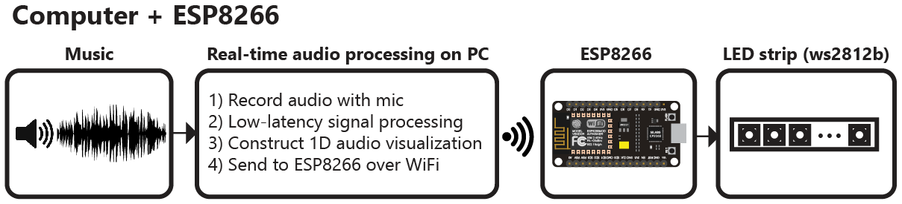
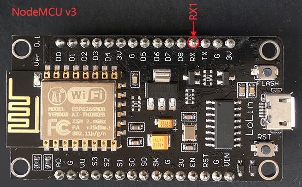
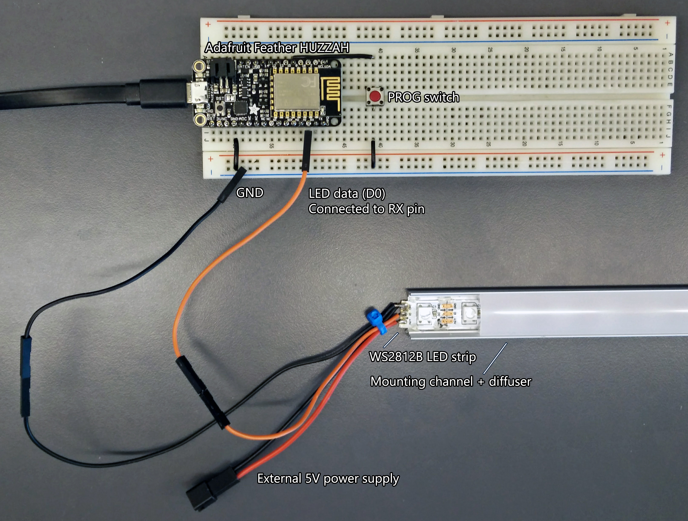
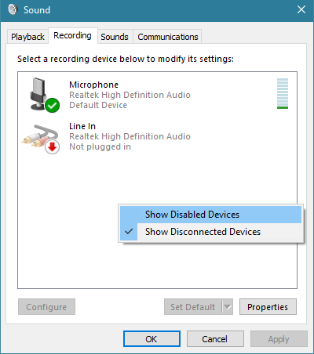
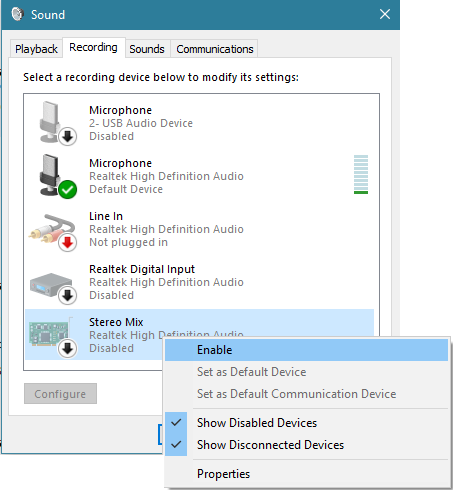

# Music Reactive WS2812 LED Strip via PC and raspberry with ESP8266

Want to enjoy some music reactive without any hassling wiring and microphone like stuff along with arduino, then this will be perfect for you!

This project utilises sound/music from PC and process it accordingly and send over wifi to ESP8266 device 

# Parts, tools, softwares required:

Hardware Required:
1. ESP8266 (I have used NodeMCU)
2. Programmable LED Strip (I have used WS2812B)
3. Laptop/PC
4. Raspberry pi (Not covered in this documentation, I have raspberry pi but do not have usb-sound card)
5. Wiring, resistors-capacitors for avoid burning your WS2812 or ESP8266

Software Required:
1. Arduino IDE for flashing code to ESP8266
2. Anaconda installed on PC (https://www.anaconda.com/download/) for python environment
3. Working condition PC for all processing stuff with working sound card!

Tools Required:
Basic knowledge is reuired 

# How things are working?

The repository includes everything needed to build an LED strip music visualizer (excluding hardware):

- Python visualization code, which includes code for:
  - Recording audio with a microphone ([microphone.py](Python/microphone.py))
  - Digital signal processing ([dsp.py](Python/dsp.py))
  - Constructing 1D visualizations ([visualization.py](Python/visualization.py))
  - Sending pixel information to the ESP8266 over WiFi ([led.py](Python/led.py))
  - Configuration and settings ([config.py](Python/config.py))
- Arduino firmware/code for the ESP8266 ([ws2812_controller.ino](https://anshumanfauzdar.github.io/Sound-and-music-reactive-ESP8266-WS2812B/Arduino/ESP8266%20code/ws2812_controller.ino))

So, music/sound is processed and hence signals are transferred to ESP8266

ESP8266 recieving signals:

## Configuring Arduino and Anaconda

# Arduino IDE

- Install latest Arduino IDE from "https://www.arduino.cc/en/main/software"
  - Install all dependencies and libraries which include ESP8266 boards, ESP8266 libraries, FastLED, Neopixel Library, Neopixel BUS library
  - 

# Connections

ESP8266 connection edit out pin output according to your requirement in ([ws2812_controller.ino](https://anshumanfauzdar.github.io/Sound-and-music-reactive-ESP8266-WS2812B/Arduino/ESP8266%20code/ws2812_controller.ino))

Connection WS2812 with care is important as they are very sensitive to voltage change and you can easily burn them!

# Sound selection

Stereo sound is preffered if you want to utilise music from your PC not from micrphone of PC

So, select stereo connection from sounds properties, and if it is not showing up - right click and check for disabled devices, if still it doesnot show you can use third party software like "VoiceMeeter"

# Project Credits:

This is refined Version of ([@scottlawsonbc](https://github.com/scottlawsonbc/audio-reactive-led-strip)) and all schematics + Tutorial and all the errors and instructions covered

Arduino refined code is by ([@joeybab3](https://github.com/joeybab3/audio-reactive-led-strip/blob/master/arduino/ws2812_controller/ws2812_controller.ino)), ([@gorgitko](https://github.com/gorgitko/microboard-projects/tree/master/audio-reactive-led-strip))
 
 
 
 
